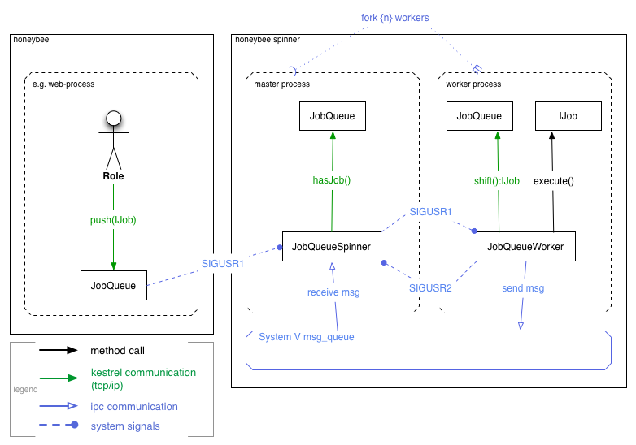

# JobQueue

## Table of contents

- [Introduction](#introduction)
- [Implementing Jobs](#implementing-jobs)
    - [Extending DocumentJob](#extending-documentjob)
    - [Extending BaseJob](#extending-basejob)
    - [Implementing IJob](#implementing-ijob)
- [Managing Worker Pools](#managing-worker-pools)
- [Architecture](#architecture)

## Introduction

Honeybee ships with a JobQueue component, 
that allows to asynchronously execute longer running tasks, 
such as for example video transcoding or large data transformations.  
The JobQueue uses the Kestrel message queue to get the critical queueing work done 
and adds a PHP interface for defining jobs and distributing them to a pool of long running workers via Kestrel.  
In order to get a specific task processed, you only need to implement a simple one-method interface, 
and can then immediately start pushing jobs to a set of worker-pools, whereas the workers may be located on different machines.  
It is also easy to spawn, kill, expand and shrink worker-pools, which can be useful to optimize the job-throughput on a specific machine. 

Read more about Kestrel here:
[robey.github.io/kestrel](http://robey.github.io/kestrel/ "Kestrel - Distributed Message Queue")  

## Implementing Jobs

To get a first job up and running, you need to either implement the 
[Honeybee\Core\Job\IJob](https://github.com/berlinonline/honeybee/blob/master/app/lib/Honeybee/Core/Job/IJob.php "Honeybee Job-Interface") 
interface or extend one of the existing job base-classes. 

- [Honeybee\Core\Job\DocumentJob](https://github.com/berlinonline/honeybee/blob/master/app/lib/Honeybee/Core/Job/DocumentJob.php "DocumentJob source") 
- [Honeybee\Core\Job\BaseJob](https://github.com/berlinonline/honeybee/blob/master/app/lib/Honeybee/Core/Job/BaseJob.php "BaseJob source") 

### Extending DocumentJob

tbd

```php
namespace Project\Job\Bundle;

use Honeybee\Core\Job\DocumentJob;

class ExampleJob extends DocumentJob
{
    protected function execute(array $parameters = array())
    {
        $document = $this->loadDocument();
        $module = $document->getModule();
        $document_service = $module->getService();
        // do something with or based on the document ...
        $document_service->save($document);
    }
}
```

### Extending BaseJob

tbd

```php
namespace Project\Job\Bundle;

use Honeybee\Core\Job\BaseJob;

class ExampleJob extends BaseJob
{
    protected $foo;

    protected $bar;

    protected function execute(array $parameters = array())
    {
        error_log(
            "Executing " . __CLASS__ . " with foo: ". $this->foo . "and bar: " . $this->bar
        );
    }
}
```

### Implementing IJob

tbd

```php
namespace Project\Job\Bundle;

use Honeybee\Core\Job\IJob;
use Honeybee\Core\Job\Queue\IQueueItem;

class ExampleJob implements IJob, IQueueItem
{
    protected $state = self::STATE_FRESH;

    public function run(array $parameters = array())
    {
        $state = null;
        try {
            // do the actual work
            $state = self::STATE_SUCCESS;
            // if things are not as expected
            //  $state = self::STATE_ERROR;
        }
        catch(\Exception $e) {
            $state = self::STATE_FATAL;
        }
        $this->setState($state);

        return $state;
    }

    public function getState()
    {
        return $this->state;
    }

    public function setState($state)
    {
        static $valid_states = array(
            self::STATE_FRESH,
            self::STATE_SUCCESS,
            self::STATE_ERROR,
            self::STATE_FATAL
        );
        if (!in_array($state, $valid_states)) {
            throw new Exception("Invalid state given.");
        }
        $this->state = $state;
    }
}
```

## Managing Worker Pools

tbd

## Architecture

tbd

Coarse grained view of the signal/execution topologie:

